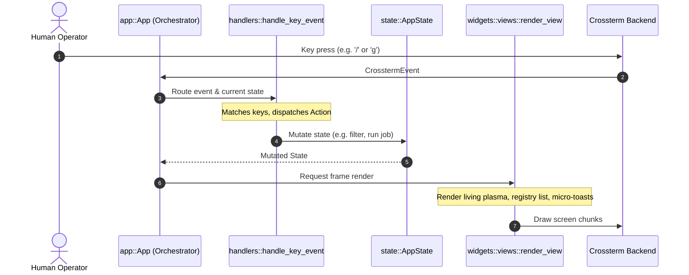
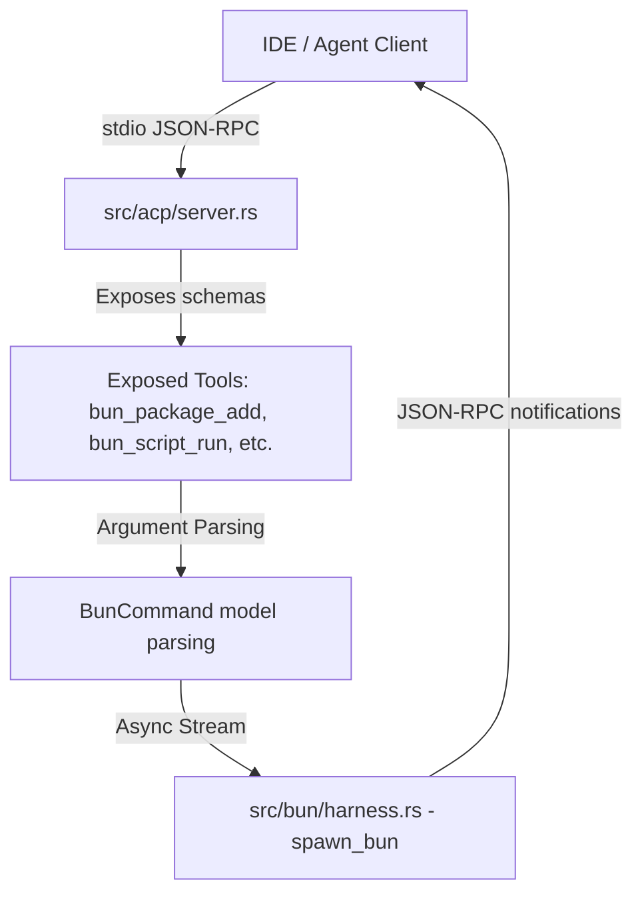

# Architecture Guide: Thumper (`thump`)

This document serves as the high-fidelity technical and architectural overview of **Thumper** (`thump`). It outlines how the Rust native core, the modular Ratatui TUI, the Python semantic harness, and the Agent Client Protocol (ACP) integrate dynamically.

---

## 1. High-Level Architecture Overview

Thumper is designed as a hybrid system that bridges a lightning-fast Rust native telemetry execution core with a robust Python semantic harness, optimized for both human full-screen interactive dashboards and remote developer agent invocation (via ACP).

```mermaid
graph TD
    subgraph Host Shell & IDEs
        Client[IDE Client: Zed / Neovim / Cursor]
        Shell[Host Terminal / Human Operator]
    end

    subgraph Thumper Native Core (Rust)
        App[main.rs]
        TUI[src/tui/ - Ratatui TUI Engine]
        ACP[src/acp/ - ACP JSON-RPC Server]
        BunRunner[src/bun/ - Native Bun execution]
        Emitters[src/generator/ - Rust axum / Go / Python Emitters]
    end

    subgraph Semantic Harness (Python)
        PyThump[thump/ - Python proxy & bridge]
        Absorb[absorb.py - Semantic absorption tool]
    end

    %% Wiring
    Shell -->|Human: thump| TUI
    Client -->|Agent: thump agent stdio| ACP
    App --> TUI
    App --> ACP
    TUI --> BunRunner
    ACP --> BunRunner
    BunRunner -->|Injects THUMP_PARENT_ACTIVE| PyThump
    PyThump -->|Absorb flow / API Gen| Absorb
    BunRunner -->|Telemetry Parser| Shell
```

---

## 2. Modular TUI Design System (`src/tui/`)

Following our comprehensive refactoring sweep, the TUI codebase has been cleanly partitioned from a monolithic structure into specialized submodules to guarantee stability, modularity, and high-velocity iterations.



### Module Responsibilities

| Component | Responsibility |
| :--- | :--- |
| **[mod.rs](file:///Users/clubpenguin/Documents/API/api-anything/src/tui/mod.rs)** | Public entry point `run()`, terminal raw-mode lifecycle hook, and orchestrator `App` wrapper. |
| **[app.rs](file:///Users/clubpenguin/Documents/API/api-anything/src/tui/app.rs)** | Handles the high-resolution tick loop, async channel receivers (`mpsc::UnboundedReceiver`), background thread scheduling, and test setups. |
| **[state.rs](file:///Users/clubpenguin/Documents/API/api-anything/src/tui/state.rs)** | Manages `AppState`, completed jobs metrics, fuzzy completions (`CompletionState`), transient `Toast` queues, and Bun stdout line-parsing. |
| **[handlers.rs](file:///Users/clubpenguin/Documents/API/api-anything/src/tui/handlers.rs)** | Processes keyboard inputs, drives menu navigation, controls history backlogs, and dispatches actions. |
| **[widgets/views.rs](file:///Users/clubpenguin/Documents/API/api-anything/src/tui/widgets/views.rs)** | Computes sub-layouts, draws Catppuccin color-themed panels, handles the fuzzy registry, and renders streaming job screens. |
| **[widgets/plasma.rs](file:///Users/clubpenguin/Documents/API/api-anything/src/tui/widgets/plasma_bar.rs)** | Custom high-fidelity drawing algorithm rendering stage-aware Braille fractal plasma metrics. |

> [!NOTE]
> All visual styles, borders, and Catppuccin theme palettes are centralized in **[styles.rs](file:///Users/clubpenguin/Documents/API/api-anything/src/tui/styles.rs)** to prevent style pollution in rendering views.

---

## 3. Subprocess & Environment Ancestry Promotion

To circumvent infinite loop risks and eliminate the security limitations of system-level process inspection, Thumper uses structured environment variable propagation.

```mermaid
graph LR
    Rust[Rust Runner: thump] -->|Spawns python subprocess| Py[Python Harness: thump]
    Note over Rust: Sets env variable:<br/>THUMP_PARENT_ACTIVE = 1<br/>REDMICRO_ROOT = [discovered_path]
    Py -->|Check os.environ| Promote{Active Parent?}
    Promote -->|Yes| FastPath[Run directly via native Rust Bun runner]
    Promote -->|No / Standalone| SlowPath[Invoke python wrapper discovery]
```

### Why this is production-grade:
*   **Zero Sandbox Limitations**: Relies on memory-safe local process environment spaces instead of scanning `/proc` or calling Windows system bindings which can trigger security blockades.
*   **Test-Environment Isolation**: The TMUX E2E integration test-runner creates a temporary sandboxed `$HOME` to ensure no active developer histories are polluted. It dynamically propagates the parent's discovered `REDMICRO_ROOT` environment configuration straight to the spawned test shell, maintaining **6/6 green tests** everywhere.

---

## 4. Agent Client Protocol (ACP) Server Integration

For IDE integrations (Zed, Cursor, VS Code, Neovim), Thumper runs as an **ACP (Agent Client Protocol) Server**. 



### Protocol Details
*   **JSON-RPC Stdio Communication**: The server communicates over standard input/output. Stdout is locked exclusively by the ACP system (`src/cli/output.rs`) to prevent standard logs from corrupting structured JSON-RPC messages.
*   **Live Progress Streams**: Every lifecycle step and terminal output line from native `bun` processes is wrapped in a `tool_call_update` payload and streamed back as `sessionUpdate` notifications in real-time, giving agents high-fidelity context on execution states.

---
*Stomping feet, streaming telemetry, and pure delight.*
